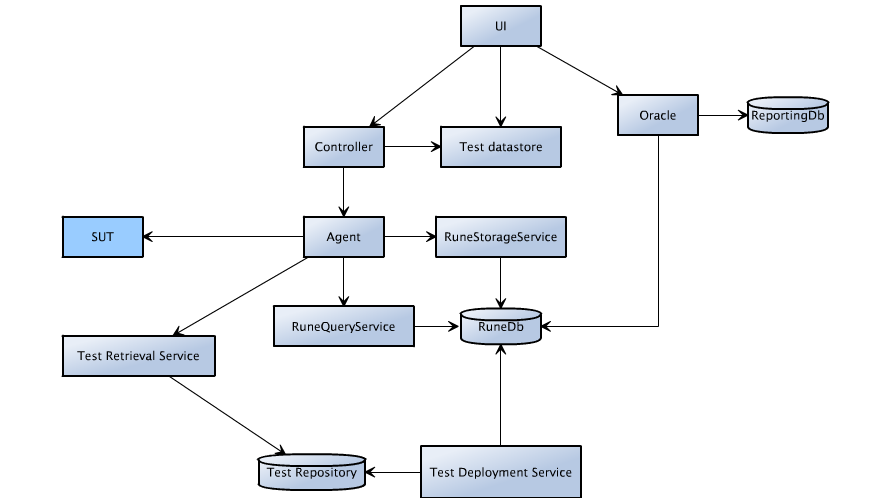
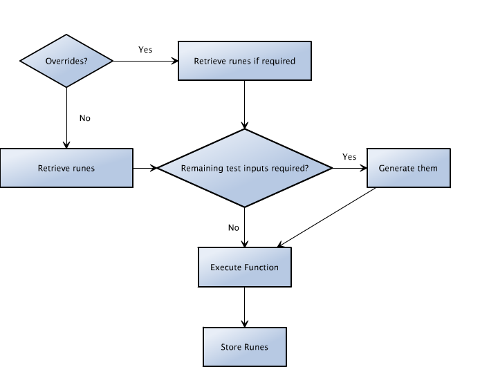
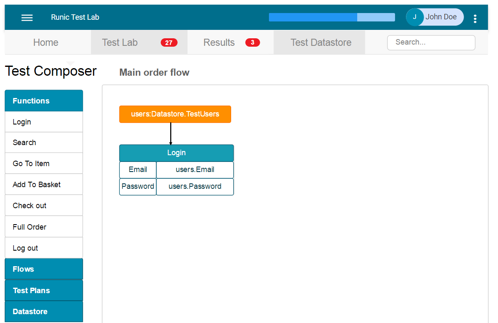

Below is a mind dump so far

Runic is a test lab and framework for running distributed automated tests. The tool is designed to support functional and performance tests.

## Basic Architecture



## The framework
The Runic framework is designed around user interactions. It supports a data-driven model of testing. 
Performing functions in the system produces data, and potentially back-end state, which can be surfaced and used in subsequent functions.

The framework designs tests that execute series of functions, and produce and store information as "runes". Some functions will require runes from other functions, and can retrieve them from the rune database. This way tests can be constructed to re-use data.  Each time a runic function finds information that might be useful to another function, or to analyse for functional acceptance, it stores it as a rune.

Functions can span across multiple pages, or APIs etc. to achieve its purpose. Some functions may also incorporate sub-functions, such as constructing a cart for an order function. The idea is to create re-usable functions that can be stringed together dynamically.

When constructing a framework, careful thought should be given to how to break up functions and how to standardise runes. Functions should be constructed to enable the most control over their actions, but also ease of integration by well-designed dependencies. Data that cannot be sourced from runes can be passed into the tests from the test data store. The test should be able to function without this input wherever possible.

###Standard structure of a function:



## Runic UI
Runic UI provides user access to the test lab and oracle functionality. The UI can be used to design and construct workflows, create and execute test plans and manage test data. The oracle is used to analyse the test results in depth and perform functional checks. 
React will be used for the UI framework. 

As a later feature, I may also add the ability create scheduled test plans.




## The Oracle
The oracle is (most likely a group of services) responsible for analysing the results from tests executed in a Runic test lab. The oracle should be designed so that the user can express the pre-conditions and expected outcomes for a test. The test can then be executed against any runes which match the pre-conditions. There may be a need to support several methods of expression, including external script execution. Possibly the use of hamstring matchers.

Some types of verification to support are:
 * Expressing preconditions to source results to verify back-end state
 * Expressing preconditions to source results to verify front end funtionality or state
 * Locating outliers in function and flow results in comparison to similar other result sets and averages
 * General statisticical analytics of performance characteristics
 
I will introduce more templated analytics at a later stage, that can also utilise the performance outputs from the framework.

## The Agent 
The Agent is responsible for executing the functions or tests. The agent loads the required executables dynamically. The agent also reports all timing related statistics to graphite. The agent executes functions or tests based on messages received from a controller, and works on a pull mechanism. Agents support multiple threads, however a test dll will only be loaded once. When retrieving runes, a local cache of runes will be checked first to improve performance. The agent is also responsible for querying and sourcing the test data required to execute the test. The order of preference of inputs to function is: 

Overidden parameters static > Overriden parameters datastore > Cached Rune > Database Rune

Example Agent process:
 * Create local rune cache
 * Listen for requests
 * Recieve execution request
 * Get test dll
 * load test dll
 * source test data
 * load test instance
 * execute class init
   * execute beforeeach
   * execute test/function
     - inject data
   * execute aftereach
 * execute class teardown

The agent will eventually have a data reservation function that can reserve an indexed field from use until a after a timeout period or until freed by the agent. As an example use case, any time an agent wants to use a customer id exclusively, it reserves the Id. The database rune query service can then exclude any runes for that customer id from use. This is not a full-proof solution but may be a handy tool.

The agent will also provide standard test hooks such as ClassInit, ClassTeardown, BeforeEachFunction, AfterEachFunction.

## The Controller
Many agents can be deployed which execute the tests based on messages from the controller. The controller orchestrates the tests based on defined parameters. The controller can control exactly how many of each function are executed, and which test inputs are used. This is designed to create a flexible framework for composing tests.

As an example for a test plan:
```
 {
    "FlowName": "MainOrderFlow",
    "Threads": 800,
    "RampUpMinutes": 10,
    "RampDownMinutes": 10,
    "ExecutionLengthMinutes": 60,
    Steps : [
       {
         "Function": "Login"
         "Repeat": 800
       },
       {
         "Function": "Search",
         "DistributionPercentage": 50,
         "InputDatasource": "datastore.test.postcodes",
         "DatasourceMapping": 
           {
             "POSTCODES_OUTCODE": "outcode"
           }
       },
       {
         "Function": "OpenItem",
          "DistributionPercentage": 30
       },
      {
        "Function": "Order",
        "DistributionPercentage": 20
      }
    ]
}
```

The controller can execute individual functions without a flow, although behind the scenes the function will likely be wrapped in a single step flow. As a potential use case, run 100 logins which produces 100 authenticated user runes, start 33% for each of search, GoToItem and AddToBasket functions. In this model, the tests re-use the runes created from each other’s execution. 
I will also add in a preference system so that runes aren't reused too often, potentially use the amount of times queried and age as factors.
The other model of test design is to program distinct flows, which are more ideal for tests that involve longer start-up times or require more complex or precise compositions of actions. 

## Test Data store
The test data store can be used to store data that tests need that cannot be sourced through runes.
The user can map tables, stored procedures or queries through to inputs for tests. The user can also created user-defined lists, tables and data-structures (like JSON) as inputs to tests. 

A possible function is to create an event system to synchronize changes to test data. The data store could subscribe to certain tests/functions or runes and update state based on the results. Although this approach does assume that the data surfaced on the front end; in the case of bugs the data may need to be sanitized. As a precaution, data could be set with expiry so only relatively new state is used for tests.
The other model is to regularly update the data store with state from the target system’s database.

## OrientDb
I'm using the document capabilities of OrientDb for the rune database. 
There will also need to be a process for regularly cleaning out expired runes.

## Kamon
I will use kamon for Graphana functionality.
