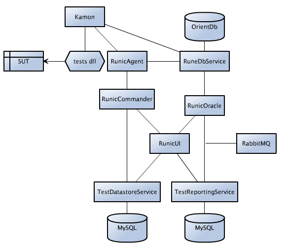

Runic is a test lab and framework for running distributed automated tests. The tool is designed to support functional and performance tests.

## The framework
The Runic framework is designed around user interactions. It supports a data-driven model of testing. 
Performing actions in the system produces data, and potentially back-end state, which can be surfaced and used in subsequent actions.
The framework designs tests around functions that produce and store this information, "runes". Some functions will require runes from other functions, and can retrieve them from the Runic database in the test lab.
Each time a runic test finds information that might be useful to another test, it stores it as a rune.
Functions can span accross multiple pages, or apis etc. to achieve an action. The idea is to create re-usable functions that can be stringed together dyanamically.
When constructing a framework, careful thought should be given to how to break up functions and how to standardise runes.
Data can be passed into the tests as a dependency from the test database. The test should be able to function without this input.

## Runic UI
Runic UI provides user access to the test lab and oracle functionality. The UI should be interactive, drag and drop etc. Can be used to create and execute test plans. The oracle is used to analyse the test results in depth and perform functional checks. 
Want to use React for the framework.
Might also add the ability to save test plans and have scheduled runs, as a second stage. Will also introduce more templated analytics at a later stage.

## The Oracle
Verify results out of a datastore using an oracle
Provides test reporting capabilities
Can be dynamically loaded with functions that take historical test results as input and verify results
Should be able to ask it questions like "What are the differences between search today and search last week"

## Agent and Controller
Many agents can be deployed which execute the tests based on messages from the controller. Agents support multiple threads.
The controller orchestrates the tests based on defined parameters. It should have the ability to control exactly how many of each function are executed, and which test inputs used. This is designed to create a flexible mechanism for running tests.

As an example for a test plan:
Function: Login, 800
Function: Search, 50%, "postcodes.csv"
Function: OpenItem, 30%
Function: Order, 20%
Threads: 800
RampUpMinutes: 10
RampDownMinutes: 10
ExecutionLengthMinutes: 60

Should be able to write a test that asks the reporting db for stats, and tests where we haven't been testing much recently.

## OrientDb
I'm going to give OrientDb a go as a database. I want to see if we can implement queries for runes faster.
Need a way to regularly clean out expired runes.

## Kamon
I hope to use kamon for Graphana functionality

# Architecture rough sketch

# Rough UI Idea
