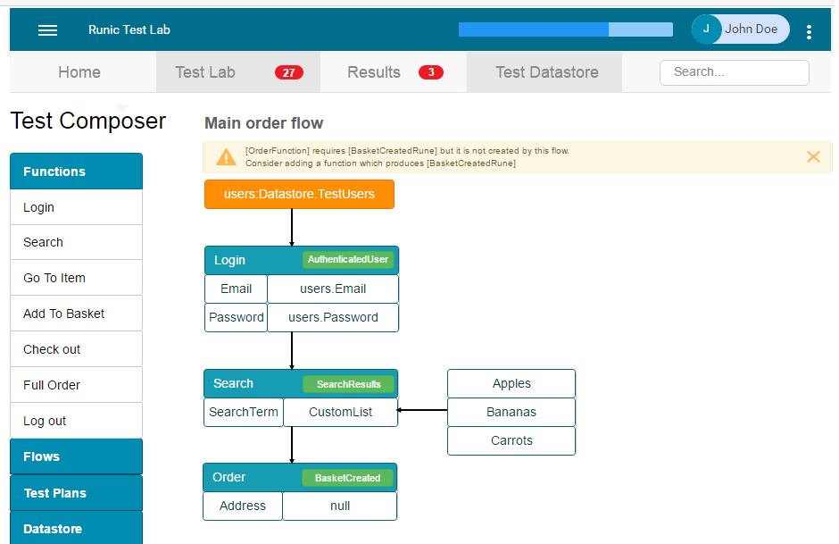

Runic is a test lab and framework for running distributed automated tests. The tool is designed to support functional and performance tests.
## Concepts
### Runes
Quite often when test against a system we want to generate load in particular parts of an application, but also want to execute functional paths.
This can be difficult when each component of the system under test requires state or data from other parts of the system. 
Normally, a functional flow will move through each part of the application; control of the ratio of load applied to the system becomes more difficult in this model.
Runes are designed to help mitigate this issue, by promoting modular functions which can share data. A rune is the result of an action executed against the SUT.
The rune is stored and can be re-used later by other functions. In this model you could for example re-use logins and control the exact number of users dynamically.

I will also add in a preference system so that runes aren't reused too often, potentially use the amount of times queried and age as factors.
The other model of test design is to program distinct flows, which are more ideal for tests that involve longer start-up times or require more complex or precise compositions of actions. 

## Goals
What I want to achieve:
 - Make it easier
   - Build out a polished framework where the engineer can not only create tests efficiently, but also use the framework to perform exploratory testing.
 - Fine grained control
   - Create, alter and schedule tests real-time
   - Control test data feeds real-time
 - A synthetic user generation framework
   - Able to simulate real system interactions
   - Promote modular and flexible test design to enhance code re-use, maintainability
 - Is highly-scalable
   - Dockerized and performant
 - Support Continuous Testing
   - Enabling real-time feedback loops for functional and non-functional attributes
 - Flexible
   - Tests written in .NET core, meaning tests have the control to exercise the SUT at many levels   
 
Principles:
  - Continuous testing
  - Modular test design
  - Data driven testing
  - Robust and flexible tests
  
## Basic Architecture

TODO update image - out of date

## The framework
The Runic framework is designed around user interactions. It supports a data-driven model of testing. 
Performing functions in the system produces data, and potentially back-end state, which can be surfaced and used in subsequent functions.

The framework designs tests that execute series of functions, and produce and store information as "runes". Some functions will require runes from other functions, and can retrieve them from the rune database. This way tests can be constructed to re-use data.  Each time a runic function finds information that might be useful to another function, or to analyse for functional acceptance, it stores it as a rune.

Functions can span across multiple pages, or APIs etc. to achieve its purpose. Some functions may also incorporate sub-functions, such as constructing a cart for an order function. The idea is to create re-usable functions that can be stringed together dynamically.

When constructing a framework, careful thought should be given to how to break up functions and how to standardise runes. Functions should be constructed to enable the most control over their actions, but also ease of integration by well-designed dependencies. Data that cannot be sourced from runes can be passed into the tests from the test data store. The test should be able to function without this input wherever possible.

###Standard structure of a function:

## Runic UI
Runic UI provides user access to the test lab and oracle functionality. The UI can be used to design and construct workflows, create and execute test plans and manage test data. The oracle is used to analyse the test results in depth and perform functional checks. 
Angular2 or React are likely choices for the UI. 

## The Oracle
The oracle is (most likely a group of services) responsible for analysing the results from tests executed in a Runic test lab. The oracle should be designed so that the user can express the pre-conditions and expected outcomes for a test. The test can then be executed against any runes which match the pre-conditions. There may be a need to support several methods of expression, including external script execution. Possibly the use of hamcrest matchers.

Some types of verification to support are:
 * Expressing preconditions to source results to verify back-end state
 * Expressing preconditions to source results to verify front end funtionality or state
 * Locating outliers in function and flow results in comparison to similar other result sets and averages
 * General statisticical analytics of performance characteristics
 
I will introduce more templated analytics at a later stage, that can also utilise the performance outputs from the framework.

## The Agent 
The Agent is responsible for executing the functions or tests. The agent loads the required executables dynamically. The agent also reports all timing related statistics to graphite. The agent executes functions or tests based on messages received from a controller. Agents support multiple threads, however a test dll will only be loaded once.

#### Possible feature: Data reservation
The data reservation function can reserve an indexed field for use until a timeout period expires or until freed by the agent. As an example use case, any time an agent wants to use a customer id exclusively, it reserves the Id. The database rune query service can then exclude any runes for that customer id from use. This is not a completely safe solution but may be a handy tool.

#### Possible feature: Registering transforms
Runic functions can have data fed to them from various sources through a single input queue, allowing real-time control of test data.
Where an appropriate rune cannot be found for a test, if a transform can be found that converts an existing rune then it will be parsed.

## Test Data store
The test data store can be used to store data that tests need that cannot be sourced through runes.
The user can map tables, stored procedures or queries through to inputs for tests. The user can also created user-defined lists, tables and data-structures (like JSON) as inputs to tests. 

A possible function is to create an event system to synchronize changes to test data. The data store could subscribe to certain tests/functions or runes and update state based on the results. Although this approach does assume that the data surfaced on the front end; in the case of bugs the data may need to be sanitized. As a precaution, data could be set with expiry so only relatively new state is used for tests.
The other model is to regularly update the data store with state from the target system’s database.

## Kamon
For Graphana functionality.
